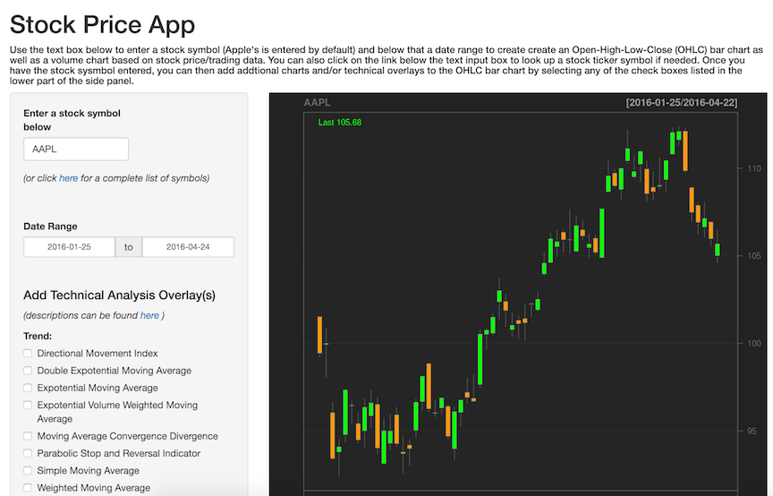
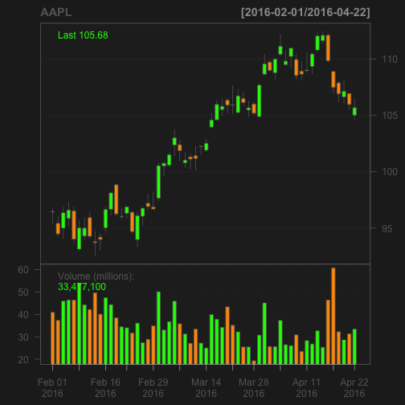

## Presentation Overview

The aim of this presentation is to provide an overview the Stock Price Analsysis App which I created and published using R's Shiny package.  This project was completed during my enrollment in the Creating Data Products course offered by John Hopkin's University as part of their Data Scientist Specalization curiculum.

--- .class #id 

## Application Description 

The Stock Price Analysis App takes a stock symbol and data range input to then retrive stock price data and create an Open-High-Low-Close (OHLC) bar chart as well as a volume chart.  Users also have the option to add addtional charts and/or technical overlays to the OHLC by selecting any of the check boxes listed in the lower part of the side panel. The server side code utilizes the 'quantmod' package developed by Jeffrey A. Ryan located on CRAN.  For more infomration about the package click  [here](https://cran.r-project.org/web/packages/quantmod/index.html).

The application can be accessed via the following URL:
[https://philliphenkels.shinyapps.io/quantmod_App/](https://philliphenkels.shinyapps.io/quantmod_App/)

--- .class #id 

## Screenshot of Application 



--- .class #id 

## Basic Code 

Here's an example of the code used to create a OHLC bar chart of Apple's stock prices over the past three months

```r
library(quantmod)
getSymbols("AAPL")
chartSeries(AAPL, subset='last 3 months')
```




